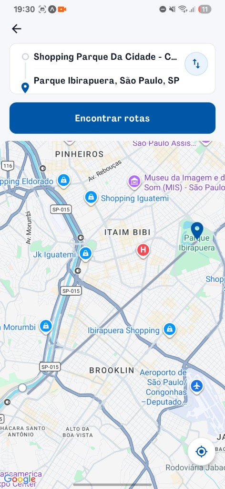
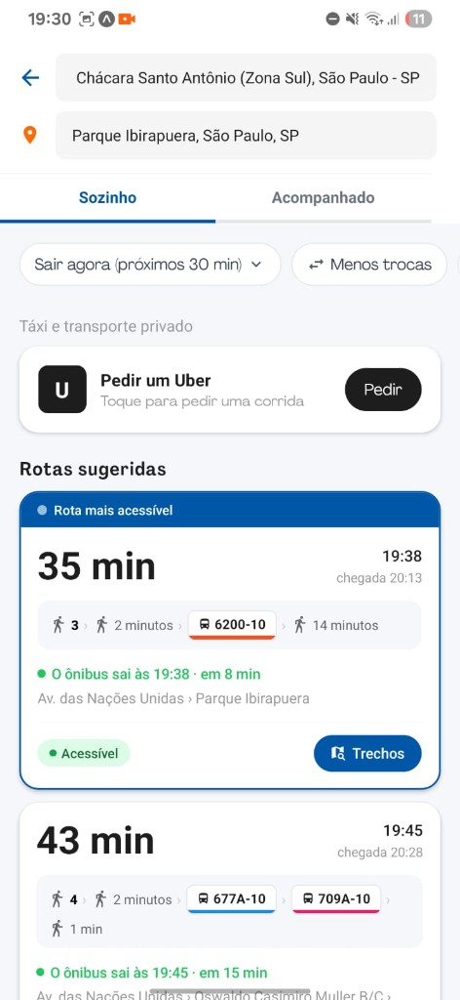
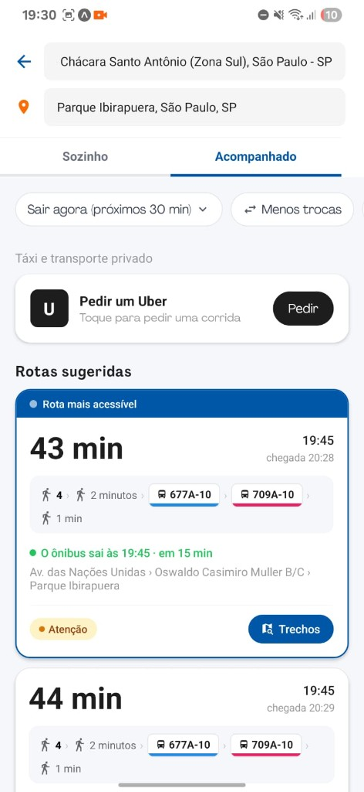
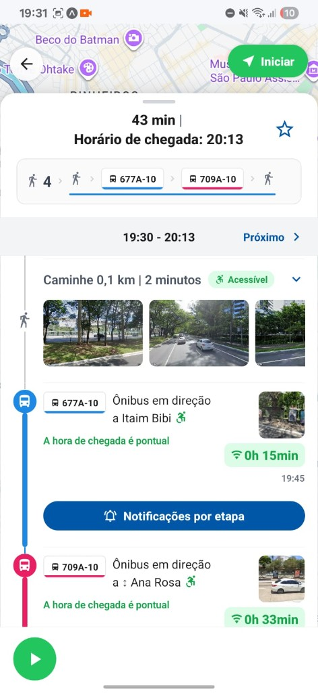
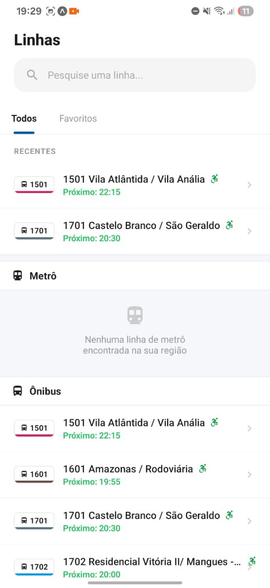
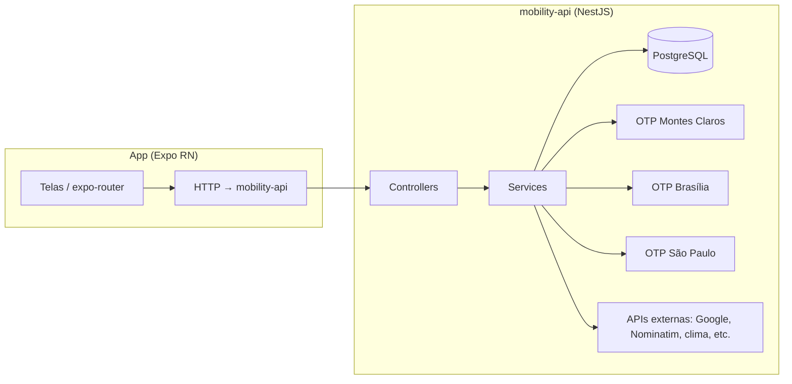

# Mobility Monorepo

Monorepo com o **aplicativo móvel** (Expo / React Native) e a **API** (NestJS) do projeto **Mobility**: mobilidade urbana com foco em **planejamento de rotas** e experiências pensadas para **acessibilidade**, integrando **roteamento multimodal** (OpenTripPlanner), dados auxiliares (Google Maps / Places, elevação, clima, etc.) e autenticação.

Este documento descreve a **arquitetura**, como **rodar** front e back, variáveis de ambiente e fluxos úteis para desenvolvimento e deploy — sem substituir detalhes locais que você mantém em `.env` (nunca commitadas).

---

## Demo

Demonstração do app em vídeo curto no YouTube — clique na imagem para abrir o Short:

[](https://www.youtube.com/shorts/OAHwycyjaSU)

**[Abrir demo no YouTube (Short)](https://www.youtube.com/shorts/OAHwycyjaSU)** — se a miniatura não carregar, use o link direto.

**Download Android (APK / build interno):** `https://expo.dev/artifacts/eas/kqdPLFhfXuUX543fEaE8SZ.apk`

---

## Screenshots

Telas do app em uso (fluxo de direções e linhas — exemplo em São Paulo).

| Splash | Início (home) |
|:------:|:-------------:|
|  |  |

| Busca de destino | Plano de rota no mapa |
|:----------------:|:---------------------:|
|  |  |

| Resultados — Sozinho | Resultados — Acompanhado |
|:--------------------:|:------------------------:|
|  |  |

| Detalhe da rota | Linhas |
|:---------------:|:------:|
|  |  |

_Arquivos em [`docs/screenshots/`](docs/screenshots/) (PNG), versionados neste monorepo para o README._

---

## Índice

- [Demo](#demo)
- [Screenshots](#screenshots)
- [Visão geral](#visão-geral)
- [Funcionalidades](#funcionalidades)
- [Arquitetura](#arquitetura)
- [Estrutura do repositório](#estrutura-do-repositório)
- [Stack tecnológica](#stack-tecnológica)
- [Pré-requisitos](#pré-requisitos)
- [Backend (`mobility-api`)](#backend-mobility-api)
- [Frontend (`mobility`)](#frontend-mobility)
- [Produção e deploy](#produção-e-deploy)
- [Testes](#testes)
- [Boas práticas de segurança](#boas-práticas-de-segurança)
- [Troubleshooting](#troubleshooting)
- [Licença](#licença)

---

## Visão geral

O **Mobility** conecta:

1. **Um cliente móvel** (Android/iOS via Expo) onde o usuário busca origem/destino, vê rotas sugeridas, perfil, histórico e fluxos de cadastro/login (incluindo Google).
2. **Uma API REST** que orquestra regras de negócio, persistência em PostgreSQL, integrações externas e chamadas a **várias instâncias regionais do OpenTripPlanner (OTP)** para planejar trajetos de transporte público e percursos associados.

O monorepo separa **dois apps independentes** em `apps/` — cada um com seu próprio `package.json`, lockfile e ciclo de vida (Docker no back; EAS/Metro no front).

---

## Funcionalidades

De forma resumida (o código-fonte é a fonte da verdade):

| Área | Descrição |
|------|-----------|
| **Rotas** | Planejamento com uso de OTP por região, camadas de acessibilidade e opções de transporte. |
| **Mapas e lugares** | Integração com ecossistema Google no app (Places / Maps, conforme chaves configuradas). |
| **Usuários** | Cadastro, login, JWT, verificação de e-mail (ex.: Resend), recuperação de senha, login Google. |
| **Linhas e estações** | Dados de linhas e estações próximas alinhados ao domínio da API. |
| **Notificações** | Expo Notifications / tokens FCM onde aplicável. |
| **Acessibilidade** | Preferências de interface (contraste, escala), fluxos e dados voltados a déficit visual, mobilidade reduzida e cadeira de rodas. |

---

## Arquitetura

Fluxo lógico simplificado:



- **Em desenvolvimento local típico**, a API e o OTP rodam em **Docker**; o app Expo na máquina ou no dispositivo aponta para a API via IP da rede ou túnel HTTPS.
- **Em produção**, o app compilado (EAS) embute `EXPO_PUBLIC_*`; a API deve estar em **HTTPS** com hostname estável.

---

## Estrutura do repositório

```
Mobility-monorepo/
├── README.md                 # Este arquivo (visão geral do monorepo)
├── docs/
│   └── screenshots/          # Imagens do README (demo visual do app)
├── .gitignore                # Ignora .env, artefatos OTP pesados, temporários da API, etc.
└── apps/
    ├── mobility/             # Cliente Expo (React Native, expo-router)
    │   ├── app/              # Rotas e telas (file-based routing)
    │   ├── components/
    │   ├── constants/        # Ex.: resolução de API_URL (EXPO_PUBLIC_API_URL)
    │   ├── services/
    │   ├── assets/
    │   ├── app.config.js     # Config dinâmica (ex.: Google Maps API key nativa)
    │   ├── app.json          # Slug Expo, package Android, plugins
    │   ├── eas.json          # Perfis EAS Build (development / preview / production)
    │   └── ...
    └── mobility-api/         # API NestJS + Docker + OTP
        ├── src/              # Código Nest (módulos, entidades, migrações TypeORM)
        ├── test/             # e2e (Jest + supertest)
        ├── otp/              # Compose OTP + grafos por região
        │   ├── docker-compose.otp.yml
        │   └── graphs/       # Dados de grafo OTP por cidade (não versionar binários pesados)
        ├── Dockerfile
        ├── docker-compose.yml   # Inclui otp/docker-compose.otp.yml
        └── ...
```

Não há pacote workspace na raiz (`pnpm-workspace` / Turborepo): cada app é um projeto **autônomo**; o monorepo apenas agrupa pastas para um único clone no GitHub.

---

## Stack tecnológica

### Frontend — `apps/mobility`

| Camada | Tecnologia |
|--------|------------|
| Framework | [Expo SDK 54](https://docs.expo.dev/), React Native |
| Navegação | [expo-router](https://docs.expo.dev/router/introduction/) |
| UI | React Native Paper, SVG, mapas (`react-native-maps`; stub web em `react-native-maps.web.tsx`) |
| Auth social | `@react-native-google-signin/google-signin` |
| Build / loja | [EAS Build](https://docs.expo.dev/build/introduction/) (`eas.json`) |
| Testes | Jest, Testing Library |

### Backend — `apps/mobility-api`

| Camada | Tecnologia |
|--------|------------|
| Runtime | Node.js (Dockerfile usa Node 22 Alpine) |
| Framework | [NestJS 11](https://nestjs.com/) |
| ORM / DB | TypeORM, PostgreSQL 16 |
| Roteamento público | [OpenTripPlanner 2.x](https://www.opentripplanner.org/) (JAR + grafos por região) |
| Infra local | Docker Compose (Postgres + 3 OTP + API + seed opcional de linhas) |
| Testes | Jest, Supertest (e2e) |

---

## Pré-requisitos

- **Node.js** 22.x recomendado para alinhar com a imagem Docker da API (desenvolvimento local pode usar versões próximas).
- **Docker Desktop** (ou equivalente) para subir Postgres + OTP + API.
- **npm** (lockfiles presentes em cada app).
- Para builds na nuvem do app: conta [Expo](https://expo.dev) e [**EAS CLI**](https://docs.expo.dev/build/setup/) (`npm i -g eas-cli`).
- **Opcional:** Android Studio / Xcode para builds nativas locais (`expo run:android` / `run:ios`).

---

## Backend (`mobility-api`)

### Subir o stack completo (recomendado)

Na pasta **`apps/mobility-api`**:

```bash
docker compose up -d --build
```

Isso sobe (conforme `otp/docker-compose.otp.yml`):

| Serviço | Descrição | Porta no host (padrão) |
|---------|-----------|-------------------------|
| `postgres` | PostgreSQL | **5432** |
| `otp-montes-claros` | OpenTripPlanner | **8080** |
| `otp-brasilia` | OpenTripPlanner | **8081** |
| `otp-sao-paulo` | OpenTripPlanner | **8082** |
| `api` | NestJS **mobility-api** | **3000** |
| `lines-seed` | Job único que pode popular linhas (segredo opcional) | — |

A API, dentro da rede Docker, usa URLs internas `http://otp-*:8080`; variáveis como `OTP_URL_*` são definidas no Compose.

### Variáveis de ambiente (API)

Crie **`apps/mobility-api/.env`** (não commitado). O Compose usa `env_file: ../.env` relativo ao contexto do serviço — na prática o arquivo esperado é **`apps/mobility-api/.env`** na raiz do app da API.

Inclua (nomes ilustrativos — valores são seus):

| Variável | Função |
|----------|--------|
| `JWT_SECRET` / chaves JWT | Autenticação |
| `DATABASE_*` | Sobrescritas no Compose para Postgres interno; úteis se rodar Nest fora do Docker |
| `GOOGLE_*`, `GEMINI_*`, chaves de mapas | Integrações de rota / LLM / Places conforme módulos habilitados |
| `RESEND_API_KEY`, `RESEND_FROM_EMAIL` | E-mail transacional |
| `LINES_SEED_SECRET` | Protege endpoint de seed de linhas (`x-lines-seed-secret`) |
| `NOMINATIM_CONTACT_EMAIL` | Uso responsável do Nominatim |
| Firebase / FCM | Notificações push, se configuradas |

**Segredo com `$`:** no `.env` usado pelo Docker Compose, use `$$` para um `$` literal onde necessário.

### Migrações

- Em **produção (Docker)**, o `Dockerfile` executa **`npm run migration:run:prod`** antes de `node dist/src/main.js`.
- Localmente (sem Docker): `npm run migration:run` com Postgres acessível e `src/data-source.ts` configurado.

---

## Frontend (`mobility`)

### Instalação e desenvolvimento

```bash
cd apps/mobility
npm ci
npx expo start
```

Perfis úteis do `package.json`:

| Script | Uso |
|--------|-----|
| `npm run start` | Expo Go / desenvolvimento |
| `npm run start:dev` | Dev Client |
| `npm run android` / `ios` | Binário nativo local |
| `npm run lint` | ESLint (Expo) |
| `npm test` | Jest |

### Variáveis de ambiente (app)

Crie **`apps/mobility/.env`** (não commitado). Principais chaves públicas embutidas no bundle:

| Variável | Função |
|----------|--------|
| `EXPO_PUBLIC_API_URL` | URL base da API (**obrigatória** em tunnel / dispositivo físico / release se não quiser depender do fallback do Metro) |
| `EXPO_PUBLIC_GOOGLE_API_KEY` | Maps / Places no app e em `app.config.js` (Android/iOS) |
| `EXPO_PUBLIC_GOOGLE_WEB_CLIENT_ID` | Login Google nativo |
| `EXPO_PUBLIC_ENABLE_GOOGLE_LOGIN` | Opcional — desliga fluxo Google se definido |
| `EXPO_PUBLIC_DEV_FORCE_LOGOUT` | Apenas desenvolvimento — limpa sessão ao abrir |

A resolução da URL da API está documentada em código em `constants/api.ts` (prioridade `.env`, depois host do Metro, emulador `10.0.2.2`, etc.).

### TypeScript

O `tsconfig.json` **exclui** a pasta `app-example/` (template legado) para `tsc --noEmit` passar no projeto real.

---

## Produção e deploy

### API

- **Docker** na sua infraestrutura ou VPS: mesma imagem compose com `.env` de produção (senhas fortes, HTTPS na borda com reverse proxy ou túnel nomeado).
- Evite expor Postgres publicamente; apenas a API na porta HTTPS.

### App (EAS)

- Perfis em **`apps/mobility/eas.json`**: `development`, `preview` (APK interno), `production` (loja / AAB).
- Variáveis **`EXPO_PUBLIC_*`** para builds devem estar configuradas no painel Expo (**Environment variables**) por ambiente (`production`, `preview`, …), pois **não** são lidas automaticamente do seu `.env` local na nuvem.
- **Login Google no Android:** cadastre o pacote `com.mobility.app` e o **SHA-1** do keystore de release no Google Cloud Console (obtenha via `eas credentials`).
- **Tunnel efêmero** (`*.trycloudflare.com`): hostname pode mudar ao reiniciar — atualize `EXPO_PUBLIC_API_URL` no EAS quando isso ocorrer ou use túnel/domínio estável.

### Artefatos OTP pesados

O `.gitignore` ignora **`.pbf`**, **`.jar`** OTP e dumps grandes sob `apps/mobility-api/otp/`. Para builds completos, esses arquivos precisam existir na máquina ou pipeline que roda o Compose (documente internamente onde obtê-los).

---

## Testes

### API (`apps/mobility-api`)

```bash
npm ci
npm run build
npm test
npm run test:e2e
```

`test:e2e` espera PostgreSQL acessível (ex.: Docker na porta 5432); ajuste `DATABASE_*` no ambiente se necessário.

### App (`apps/mobility`)

```bash
npm ci
npm run lint
npm test
npx tsc --noEmit
```

---

## Boas práticas de segurança

- **Nunca commite** `.env`, chaves JWT, chaves de API privadas ou keystores.
- Rotacione credenciais que tenham vazado em chats, prints ou issues.
- Restrinja **API keys** do Google por pacote Android/iOS e por IP/referrer quando possível.
- Use **HTTPS** sempre que o app em release falar com a API.

---

## Troubleshooting

| Sintoma | Caminho provável |
|---------|-------------------|
| App não acha a API | `EXPO_PUBLIC_API_URL`, firewall, API ouvindo em `0.0.0.0:3000`, túnel expirado |
| Erro de migração / coluna inexistente | Reset controlado do volume Postgres em dev **ou** aplicar migrações na ordem correta |
| OTP fora do ar | Memória JVM (`-Xmx`), grafos montados em `otp/graphs/...`, logs do container Java |
| Build EAS sem Maps | `EXPO_PUBLIC_GOOGLE_API_KEY` ausente no ambiente do perfil de build |
| Login Google só falha no APK | SHA-1 / OAuth Android incorretos no Google Cloud |

---

## Licença

Os pacotes neste monorepo estão marcados como **privados** / **`UNLICENSED`** nos manifests onde aplicável. Defina licença e política de contribuição conforme a decisão do time antes de tornar o repositório público.

---

## Links úteis

- [Documentação Expo](https://docs.expo.dev/)
- [EAS Build](https://docs.expo.dev/build/introduction/)
- [NestJS](https://docs.nestjs.com/)
- [OpenTripPlanner](https://opentripplanner.io/)
- [README — guia profissional (referência de estrutura)](https://coding-boot-camp.github.io/full-stack/github/professional-readme-guide/)

---
